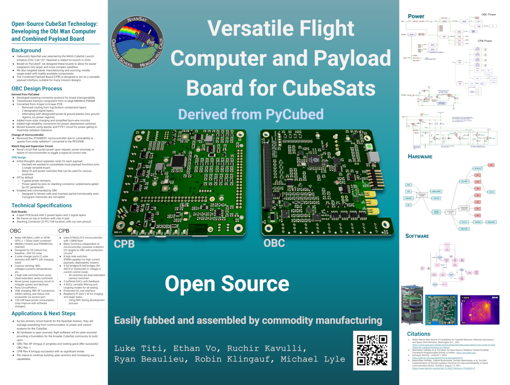

# Obi Wan Komputer and Combined Payload Board
## Oakwood Engineering, NyanSat Project

Welcome to the public git repository for NyanSat's OBC and payload board.  We hope that this project will be generally useful for the CubeSat community.  NyanSat is a 2U CubeSat selected by NASA's CubeSat Launch Initiative and made by high school students at [Oakwood School](https://oakwoodway.org).

[NyanSat Obi Wan Komputer and Combined Payload Board](https://github.com/OakwoodEngineering/ObiWanKomputer) by [Oakwood Engineering](https://nyansat.org) is licensed under [Creative Commons Attribution-ShareAlike 4.0 International](https://creativecommons.org/licenses/by-sa/4.0/?ref=chooser-v1)    

It is based on the [PyCubed](https://pycubed.org) flight computer by Max Holliday.

The design was made with [Kicad EDA](https://www.kicad.org/) version 8 and is in the hardware directory.  More details to come.

For now, an overview of the design is in the following poster presented at Cal Poly's [CubeSat Developer Workshop](https://www.cubesatdw.org/) 2025 (click for PDF):

You can also visit our website at [nyansat.org](https://nyansat.org).
